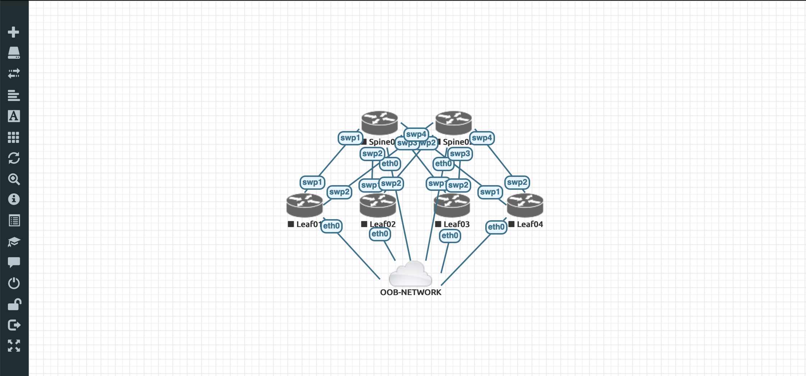

# EVE-NG for CI/CD pipeline.

This script has been tested with *EVE-NG - 2.0.5-12-PRO* ```19.04.2019``` and *Community Edition 2.0.3-95* ```09.05.2019```

```shell

# [--vm=] default value is {./vm/vm_info.yml}
# --vm=./vm/vm_info.yml is useless if your VM informations are at this path

./eveng-api.py --vm=./vm/vm_info.yml --deploy=./architecture/2spines_4leafs.yml
./eveng-api.py --vm=./vm/vm_info.yml --deploy=./architecture/2access_2distrib.yml 
#
# Execution some tasks
#
./eveng-api.py --vm=./vm/vm_info.yml --stop=spine-leaf.unl
./eveng-api.py --vm=./vm/vm_info.yml --start=spine-leaf.unl
./eveng-api.py --vm=./vm/vm_info.yml --backup=./backup/lab_to_backup.yml
./eveng-api.py --vm=./vm/vm_info.yml --remove=spine-leaf.unl
./eveng-api.py --vm=./vm/vm_info.yml --test=True
./eveng-api.py --vm=./vm/vm_info.yml --images=True
```

> You can find information about "How write your network architecture YAML file in https://gitlab.com/DylanHamel/python-eveng-api/wikis/home


## Project presentation
Every days you hear about "CI/CD", pipeline or DevOps.
Often pipeline is defined as follow 

```
Plan --> Code --> Build --> Test --> Release --> Deploy --> Operate Monitor
```

It's beautiful but in Network case 

* How can we test our Network ??
* How can we virtualize our Network ??
* If I change my underlay eBGP configuration, how I can know that my network still works ??
* How I can detect that my modification works ???

All these questions are current.
In network domain, we can change our pipeline.

1. Code Ansible playbooks that will be modified our Network
2. Create a Virtual network that are the same in production
    In other words, I need to have my production network in a virtual environment.
    I need to deploy a network based on my production backup files

3. Test our network. We have to write some Ansible playbooks for example that can validate that my network works
    Check nodes LLDP neighbors and validate that all my node see their neighbors
    Ping all nodes between them
    Check nodes eBGP neighbors
    Check nodes routing tables
    and so ...

4. If the network works fine we can go in production deployment.


After these informations you can maybe says "Ok but how i can deploy my network ??".
Some tools are here for you.
You can use Vagrant, EVE-NG or GNS3. There are a lot of others tools!

**More difficult thing is define "how do you want work and how do you really need ?"**
This point is very very difficult and is not your own responsability.
You need to discuss about it with your team and define the best pipeline that you need for your infrastructure and organization !!

This repo contains a script that can deploy a virtual network based on your production network.
As say before it is not the best and the only way to vritualize a network and make your tests.
But with this base you can work and advance in your Network as Code and NetOps transformation.

Idea behind this repo is that you can use EVE-NG as a step (virtualize and tests) of your CI/CD pipeline.
Example based on Cumulus.
This repo contains functions for Cumulus Network. If you need more device types you need implement functions for them.

**Your help is welcome**
#### Become a contributor !! 

### Objective
The main objective of this project is automatically deploy a network architecture on EVE-NG based on a YAML file.
YAML file will contains your lab architecture.
* Links
* Devices

You can also deploy a configuration into your devices.
With this feature you can deploy your lab based on your production network backup.
With a simple command you can create your production network in a virtual environnement and test your scripts or your CLI.

This step can be insert into a CI/CD pipeline.
Deploy architecture and test your modification or you code.
If ok, your modification will be applied in your production lab.

An other repository is in developement about "How can we test ou virtual network" and "How can we validate that modifications work fine"

## Project Structure

- ```eve-ng.py``` is the script with which you will interact and run commands. 

- ```PyEVENG.py``` is a Class for interact with your VM via REST API or SSH.

- ```abstract_device.py``` some actions are differents for each devices.
Exampple :
If you want backup a device you need to backup "show run" for Cisco but,
for a Cumulus Network device you nned to backup a lot of files in ```/etc`/```.
This abstract class implement functions common to all devices and declare as
```@abstractmethod``` functions that have to be implement for each devices

- ```xxx_devcice.py``` (```cumulus_devcice.py```, ```extreme_devcice.py```, ...)
are some method implementations and specifications for execute method
Example ```getConf()```. In Cumulus specification this function will backup 
necessary files in ```/etc/``` and for Extreme it will backup ```config.cfg```
It is important to developp a class per device type.
(There are some modifications to do in PyEVENG.py file - this part need to be 
rethought)

- ```eveng-yaml-validation.py``` is used for validate your yaml topology files.
For example this script avoids that you have 6 nodes called Leaf01...

- ```./vm/vm_info.yml```  describes your EVE-NG VM (ssh user/pass, http user/pass, IP address, ...)

- ```./architecture/all.yml``` contains informations about your lab that you want create
It contains devices and links between them that they have to be creat

- ```lab_to_backup.yml``` contains informations about lab backup.
If you want backup your devices after modifications.

- ```./commands/*``` contains specific commands for device types (Cumulus, Extreme, ...)

## Run the script

```yml
project:
  # Lab description
devices:
  # devices to add
links:
  # links between devices
configs:
  # config to push in devices
```


```shell

# ---------------------------------------------------------------------------
### 0. Create your Lab - USELESS La creation can be insert into deploy yaml file.
##./eveng-api.py --create=/path/to/yml/lab

# 1. Deploy your topology on your lab
./eveng-api.py --deploy=/path/to/yml/topology
    
    # This step will :
    # - create Lab
    # - create devices
    # - create links
    # - start nodes for create folders
    # - stop nodes
    # - push config on nodes
    # - start nodes

# If lab creation doesn't work - lab will be remove

# ---------------------------------------------------------------------------
# At this point you can run Ansible/Salt/Chef/Python script on your network
# via the oob management network.
# You can see architecture in the WEB page and manage via CLI/Shell
# ---------------------------------------------------------------------------

# 3. If your network works fine backup nodes !
./eveng-api.py --backup=/path/where/backup 

# 4. Stop nodes
./eveng-api.py --stop=labName.unl,/path/to/vm/info/yaml/file.yml

# 5. Remove lab
./eveng-api.py --remove=labName.unl,/path/to/vm/info/yaml/file.yml

```

## Example

A YAML file contains an architecture that describe a simple Data Center architecture

* 2 Spines
* 4 Leaves
* Leaves are connected on Spine
  * Leaf01 swp1 -> Spine01 swp1
  * Leaf02 swp1 -> Spine01 swp2
  * etc.

You can find this YAML file in ```./architecture/2spines_3leafs.yml```

In this YAML file I create a connexion on the Out-Of-Band network.

```yaml
- id: 9
    network: pnet4
    src:
      - host: Spine01
        port: eth0
      - host: Spine02
        port: eth0
      - host: Leaf01
        port: eth0
      - host: Leaf02
        port: eth0
      - host: Leaf03
        port: eth0
      - host: Leaf04
        port: eth0
    dst: OOB-NETWORK
    dport: oob
```

I give the directory that contains nodes configuration 

```yaml
configs:
  - node: Spine01
    type: full
    config: /Volumes/Data/gitlab/python-eveng-api/backup/cumulus-spine-leaf.unl/Spine01
  - node: Spine02
    type: full
    config: /Volumes/Data/gitlab/python-eveng-api/backup/cumulus-spine-leaf.unl/Spine02
  - node: Leaf01
    type: full
    config: /Volumes/Data/gitlab/python-eveng-api/backup/cumulus-spine-leaf.unl/Leaf01
  - node: Leaf02
    type: full
    config: /Volumes/Data/gitlab/python-eveng-api/backup/cumulus-spine-leaf.unl/Leaf02
  - node: Leaf03
    type: full
    config: /Volumes/Data/gitlab/python-eveng-api/backup/cumulus-spine-leaf.unl/Leaf03
  - node: Leaf04
    type: full
    config: /Volumes/Data/gitlab/python-eveng-api/backup/cumulus-spine-leaf.unl/Leaf04 
```

I run the script

```bash
./eveng-api.py --deploy=./architecture/2spines_3leafs.yml
```

Output

```bash
[create_lab]
[PyEVENG addNodeToLab] - spine-leaf is creating...
[PyEVENG addNodeToLab] - spine-leaf has been created...
[deploy_device]
[PyEVENG addNodeToLab] - Spine01 is deploying...
[PyEVENG addNodeToLab] - Spine01 has been deployed!
[PyEVENG addNodeToLab] - Spine02 is deploying...
[PyEVENG addNodeToLab] - Spine02 has been deployed!
[PyEVENG addNodeToLab] - Leaf01 is deploying...
[PyEVENG addNodeToLab] - Leaf01 has been deployed!
[PyEVENG addNodeToLab] - Leaf02 is deploying...
[PyEVENG addNodeToLab] - Leaf02 has been deployed!
[PyEVENG addNodeToLab] - Leaf03 is deploying...
[PyEVENG addNodeToLab] - Leaf03 has been deployed!
[PyEVENG addNodeToLab] - Leaf04 is deploying...
[PyEVENG addNodeToLab] - Leaf04 has been deployed!
[PyEVENG addNodesToLab] - all nodes have been deployed!
[deploy_links]
[PyEVENG addNetworkToLab] - Spine01(swp1)--Leaf01(swp1) is deploying...
[PyEVENG addNetworkToLab] - Spine01(swp1)--Leaf01(swp1) ( 201 ) has been deployed!
[PyEVENG addNetworkToLab] - Spine01(swp2)--Leaf02(swp1) is deploying...
[PyEVENG addNetworkToLab] - Spine01(swp2)--Leaf02(swp1) ( 201 ) has been deployed!
[PyEVENG addNetworkToLab] - Spine01(swp3)--Leaf03(swp1) is deploying...
[PyEVENG addNetworkToLab] - Spine01(swp3)--Leaf03(swp1) ( 201 ) has been deployed!
[PyEVENG addNetworkToLab] - Spine01(swp4)--Leaf04(swp1) is deploying...
[PyEVENG addNetworkToLab] - Spine01(swp4)--Leaf04(swp1) ( 201 ) has been deployed!
[PyEVENG addNetworkToLab] - Spine02(swp4)--Leaf04(swp2) is deploying...
[PyEVENG addNetworkToLab] - Spine02(swp4)--Leaf04(swp2) ( 201 ) has been deployed!
[PyEVENG addNetworkToLab] - Spine02(swp3)--Leaf03(swp2) is deploying...
[PyEVENG addNetworkToLab] - Spine02(swp3)--Leaf03(swp2) ( 201 ) has been deployed!
[PyEVENG addNetworkToLab] - Spine02(swp2)--Leaf02(swp2) is deploying...
[PyEVENG addNetworkToLab] - Spine02(swp2)--Leaf02(swp2) ( 201 ) has been deployed!
[PyEVENG addNetworkToLab] - Spine02(swp1)--Leaf01(swp2) is deploying...
[PyEVENG addNetworkToLab] - Spine02(swp1)--Leaf01(swp2) ( 201 ) has been deployed!
[PyEVENG addNetworkToLab] - OOB-NETWORK is deploying...
[PyEVENG addNetworkToLab] - OOB-NETWORK ( 201 ) has been deployed!
[PyEVENG addLinkToLab] - 1 1 is deploying...
https://172.16.194.239/api/labs/Users/spine-leaf.unl/nodes/1/interfaces - data={"1":"1"}
[PyEVENG addLinkToLab] - 3 1 is deploying...
https://172.16.194.239/api/labs/Users/spine-leaf.unl/nodes/3/interfaces - data={"1":"1"}
[PyEVENG addLinkToLab] - 1 2 is deploying...
https://172.16.194.239/api/labs/Users/spine-leaf.unl/nodes/1/interfaces - data={"2":"2"}
[PyEVENG addLinkToLab] - 4 1 is deploying...
https://172.16.194.239/api/labs/Users/spine-leaf.unl/nodes/4/interfaces - data={"1":"2"}
[PyEVENG addLinkToLab] - 1 3 is deploying...
https://172.16.194.239/api/labs/Users/spine-leaf.unl/nodes/1/interfaces - data={"3":"3"}
[PyEVENG addLinkToLab] - 5 1 is deploying...
https://172.16.194.239/api/labs/Users/spine-leaf.unl/nodes/5/interfaces - data={"1":"3"}
[PyEVENG addLinkToLab] - 1 4 is deploying...
https://172.16.194.239/api/labs/Users/spine-leaf.unl/nodes/1/interfaces - data={"4":"4"}
[PyEVENG addLinkToLab] - 6 1 is deploying...
https://172.16.194.239/api/labs/Users/spine-leaf.unl/nodes/6/interfaces - data={"1":"4"}
[PyEVENG addLinkToLab] - 2 4 is deploying...
https://172.16.194.239/api/labs/Users/spine-leaf.unl/nodes/2/interfaces - data={"4":"5"}
[PyEVENG addLinkToLab] - 6 2 is deploying...
https://172.16.194.239/api/labs/Users/spine-leaf.unl/nodes/6/interfaces - data={"2":"5"}
[PyEVENG addLinkToLab] - 2 3 is deploying...
https://172.16.194.239/api/labs/Users/spine-leaf.unl/nodes/2/interfaces - data={"3":"6"}
[PyEVENG addLinkToLab] - 5 2 is deploying...
https://172.16.194.239/api/labs/Users/spine-leaf.unl/nodes/5/interfaces - data={"2":"6"}
[PyEVENG addLinkToLab] - 2 2 is deploying...
https://172.16.194.239/api/labs/Users/spine-leaf.unl/nodes/2/interfaces - data={"2":"7"}
[PyEVENG addLinkToLab] - 4 2 is deploying...
https://172.16.194.239/api/labs/Users/spine-leaf.unl/nodes/4/interfaces - data={"2":"7"}
[PyEVENG addLinkToLab] - 2 1 is deploying...
https://172.16.194.239/api/labs/Users/spine-leaf.unl/nodes/2/interfaces - data={"1":"8"}
[PyEVENG addLinkToLab] - 3 2 is deploying...
https://172.16.194.239/api/labs/Users/spine-leaf.unl/nodes/3/interfaces - data={"2":"8"}
[PyEVENG addLinkToLab] - 1 0 is deploying...
https://172.16.194.239/api/labs/Users/spine-leaf.unl/nodes/1/interfaces - data={"0":"9"}
[PyEVENG addLinkToLab] - 2 0 is deploying...
https://172.16.194.239/api/labs/Users/spine-leaf.unl/nodes/2/interfaces - data={"0":"9"}
[PyEVENG addLinkToLab] - 3 0 is deploying...
https://172.16.194.239/api/labs/Users/spine-leaf.unl/nodes/3/interfaces - data={"0":"9"}
[PyEVENG addLinkToLab] - 4 0 is deploying...
https://172.16.194.239/api/labs/Users/spine-leaf.unl/nodes/4/interfaces - data={"0":"9"}
[PyEVENG addLinkToLab] - 5 0 is deploying...
https://172.16.194.239/api/labs/Users/spine-leaf.unl/nodes/5/interfaces - data={"0":"9"}
[PyEVENG addLinkToLab] - 6 0 is deploying...
https://172.16.194.239/api/labs/Users/spine-leaf.unl/nodes/6/interfaces - data={"0":"9"}
[PyEVENG startLabNode] - spine-leaf.unl Spine01 is starting...
[PyEVENG startLabNode] - spine-leaf.unl Spine02 is starting...
[PyEVENG startLabNode] - spine-leaf.unl Leaf01 is starting...
[PyEVENG startLabNode] - spine-leaf.unl Leaf02 is starting...
[PyEVENG startLabNode] - spine-leaf.unl Leaf03 is starting...
[PyEVENG startLabNode] - spine-leaf.unl Leaf04 is starting...
[PyEVENG stopLabNode] - spine-leaf.unl Spine01 is stopping...
[PyEVENG stopLabNode] - spine-leaf.unl Spine02 is stopping...
[PyEVENG stopLabNode] - spine-leaf.unl Leaf01 is stopping...
[PyEVENG stopLabNode] - spine-leaf.unl Leaf02 is stopping...
[PyEVENG stopLabNode] - spine-leaf.unl Leaf03 is stopping...
[PyEVENG stopLabNode] - spine-leaf.unl Leaf04 is stopping...
[deploy_config]
#...
#...
# I remove the config output becase it is tooooooo long for the moment
#...
#...
[PyEVENG startLabNode] - spine-leaf.unl Spine01 is starting...
[PyEVENG startLabNode] - spine-leaf.unl Spine02 is starting...
[PyEVENG startLabNode] - spine-leaf.unl Leaf01 is starting...
[PyEVENG startLabNode] - spine-leaf.unl Leaf02 is starting...
[PyEVENG startLabNode] - spine-leaf.unl Leaf03 is starting...
[PyEVENG startLabNode] - spine-leaf.unl Leaf04 is starting...
------------------------------------------------------------
```


#### Your lab is now deploy :smiley:



And you can manage your device directly from your local machine

```shell
/Volumes/Data/gitlab/python-eveng-api(master*) » ssh -l cumulus spine01
cumulus@spine01's password:
------------------------------------------------------------
/Volumes/Data/gitlab/python-eveng-api(master*) » ssh -l cumulus spine02
cumulus@spine02's password:
```

(Spine02 is added in my ```/etc/hosts```)

```shell
/Volumes/Data/gitlab/python-eveng-api(master*) » cat /etc/hosts | grep -i spine02
10.0.4.102	spine02
```

```10.0.4.102``` is the OOB IP address defined in your YAML  ```configs:```

```yaml
- node: Spine02
    type: full
    config: /Volumes/Data/gitlab/python-eveng-api/backup/cumulus-spine-leaf.unl/Spine02
```

```shell
(master*) » grep -i -A 3 "eth0" backup/cumulus-spine-leaf.unl/Spine02/interfaces
auto eth0
iface eth0
    address 10.0.4.102/24
    gateway 10.0.4.1
```


## Import QCOW2 (Cumulus)

Download image on Cumulus Network website :

* https://cumulusnetworks.com/products/cumulus-vx/download/

Upload in your EVE-NG VM

On your OS (MacOSX for example)

```shell
scp ./cumulus-linux-3.7.5-vx-amd64-qemu.qcow2 root@172.16.194.239:/tmp
```

Connecte on your EVE-NG VM

```shell
ssh -l root 172.16.194.239
```

Create a directory

```shell
mkdir /opt/unetlab/addons/qemu/cumulus-vx-3.7.5
```

Move your qcow2

```shell
mv /tmp/cumulus-linux-3.7.5-vx-amd64-qemu.qcow2 /opt/unetlab/addons/qemu/cumulus-vx-3.7.5/virtioa.qcow2
```

Fix permissions

```shell
/opt/unetlab/wrappers/unl_wrapper -a fixpermissions
```


You can find all informations on EVE-NG website

* https://www.eve-ng.net/documentation/howto-s


#### Need to be fixed

1) Push Config to VYOS - Need to be tested
   
2) Push Config to Nexus - Lab can be deploy but config can't be push
   
3) Cisco ports are administravely down by default
   1) Find if it's possible to modify qcow2 on backup machine
   
   