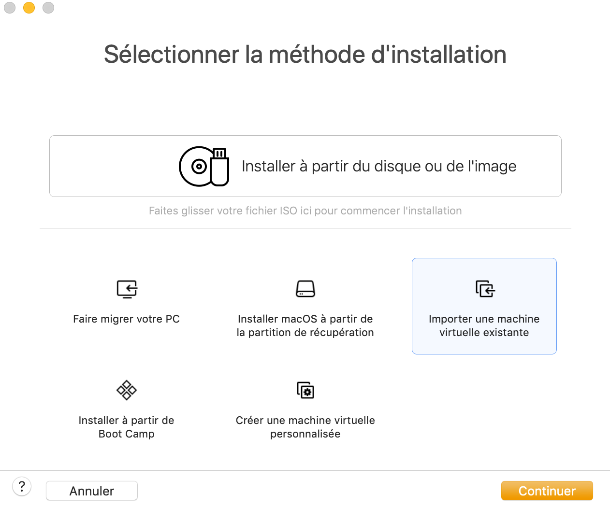
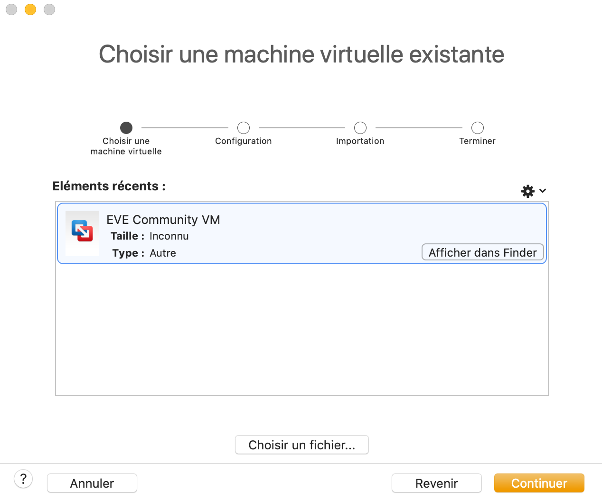
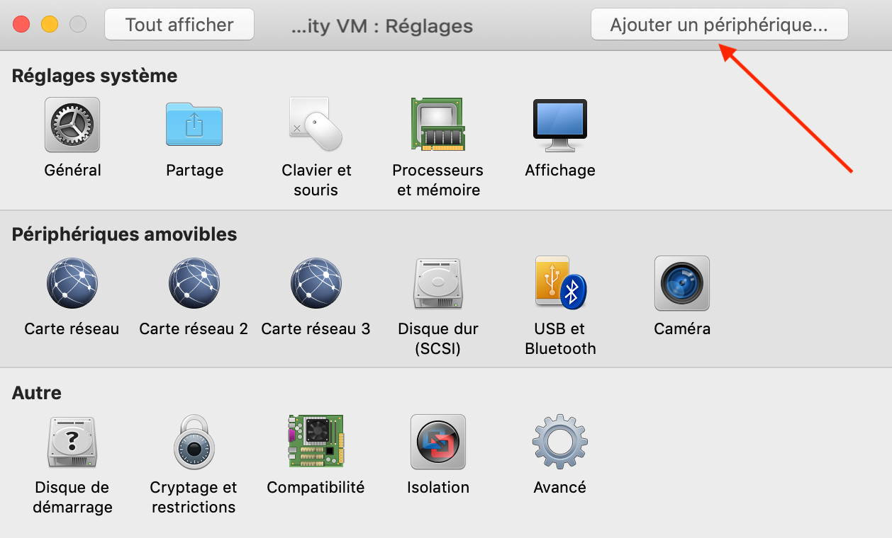
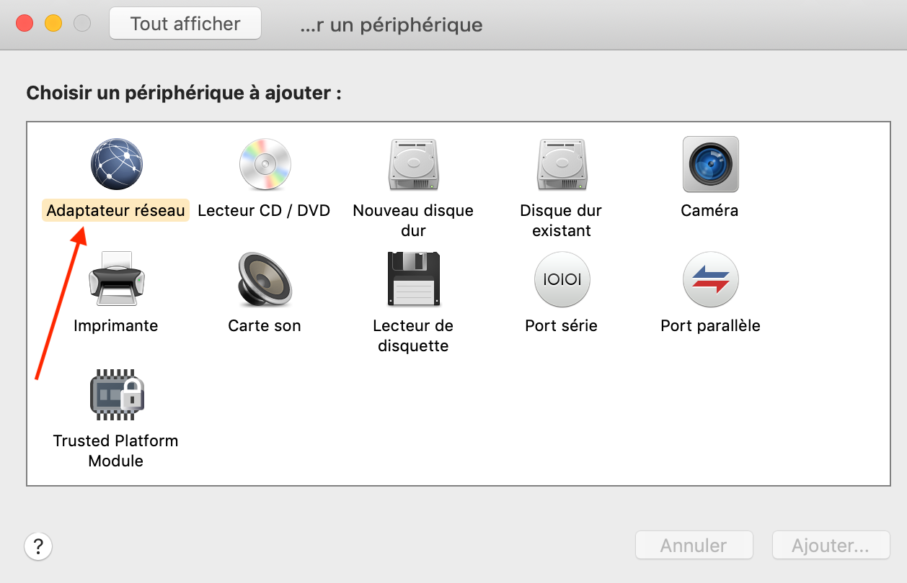
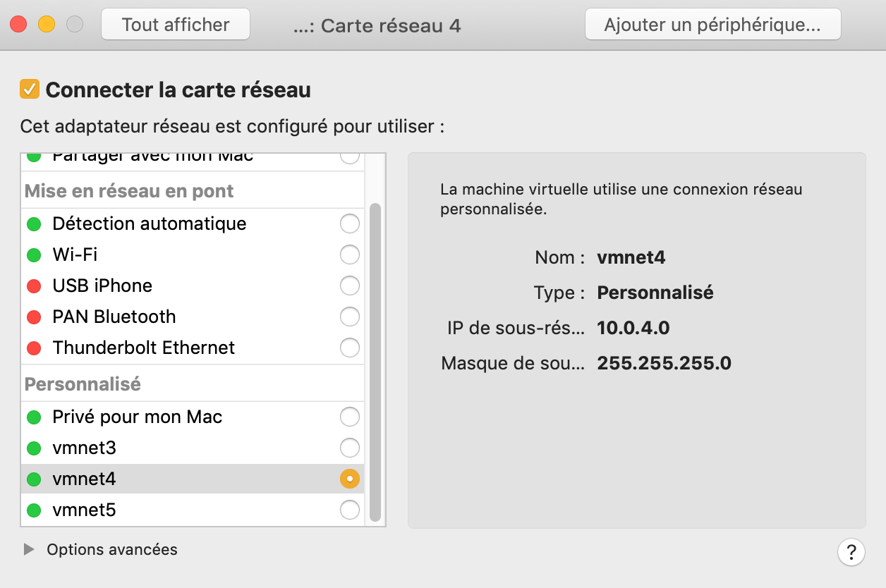
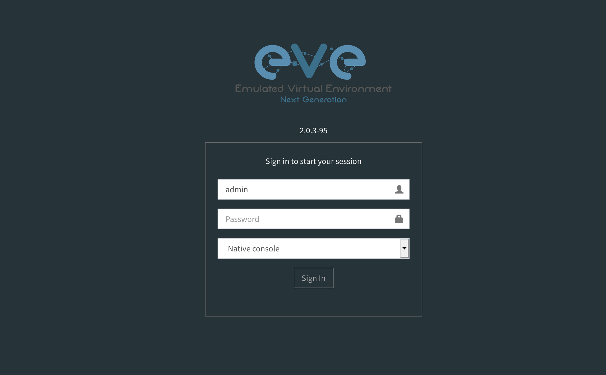
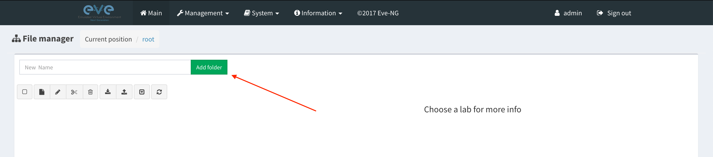
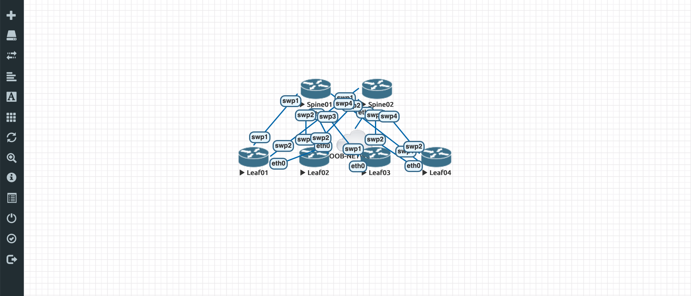
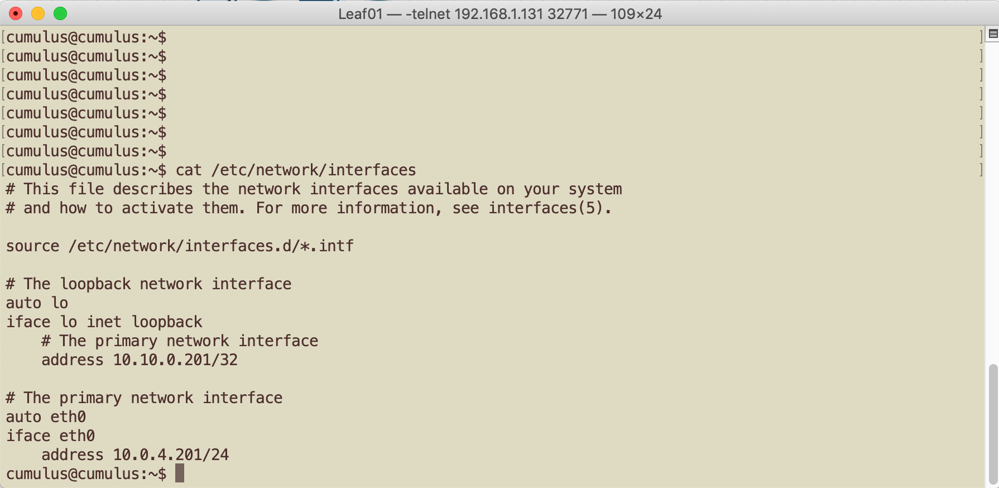

# EVE-NG Installation and deploy a Network

###### Dylan Hamel - 09/05/2019 - <dylan.hamel@protonmail.com>

###### => https://gitlab.com/DylanHamel/python-eveng-api


## Requisites

The follwing example is based on EVE-NG Community.
You need VM Fusion (MacOSx) or VM Player (Windows)


# 1. Download EVE-NG Community or PRO

Download OVA on EVE-NG official WEB site. Actually ``version 2.0.3-95``
https://www.eve-ng.net/community/community-2

* https://mega.nz/#!8x1VmapC!X7hdQPPUN1EpPtx86Wlta3Nj6tOZKXREabLHNoliwS0

* https://drive.google.com/open?id=1E4US5xwCjj6BS79DCsdRPt_Fvo4xAaKa


# 2. Deploy OVA

* Import VM




* Select EVE-NG OVA




* Add a new peripheral




* New Network Adapter




* Select a new network adapter that is shared with your laptop.

  ```shell
  # On my MacBookPro
  » ifconfig | grep -B 2 10.0.4                                                                                    
    vmnet4: flags=8863<UP,BROADCAST,SMART,RUNNING,SIMPLEX,MULTICAST> mtu 1500
  	ether 00:50:56:c0:00:04
  	inet 10.0.4.1 netmask 0xffffff00 broadcast 10.0.4.255
  ```

  With this connection i will be able to reach directly from my MacBookPro to network device virtualized on EVE-NG.




EVE-NG VM obtains via DHCP IP address ``192.168.1.131 255.255.255.0``


# 3. Install Cumulus Network ``qcow2``

Download the Cumulus Network qcow2 directly on official Cumulus Network WEB site.

Open a terminal in your laptop (MacBookPro)

Copy image to EVE-NG VM with ``scp``

* Username = ``root``
* Password = ``eve``

```shell
» scp cumulus-linux-3.7.5-vx-amd64-qemu.qcow2 root@192.168.1.131:/tmp
root@192.168.1.131's password:
cumulus-linux-3.7.5-vx-amd64-qemu.qcow2											100% 1446MB   7.1MB/s   03:23
```

Connect to your EVE-NG VM with ``ssh``

```shell
 » ssh -l root 192.168.1.131
```


On your EVE-NG VM :

Create a directory for Cumulus ``qcow2``

```shell
mkdir /opt/unetlab/addons/qemu/cumulus-vx-3.7.5
```

> Adapt your Cumulus version ``cumulus-vx-${version}``

Move the ``qcow2`` to your new directory

```shell
mv /tmp/cumulus-linux-3.7.5-vx-amd64-qemu.qcow2 /opt/unetlab/addons/qemu/cumulus-vx-3.7.5/virtioa.qcow2
```

Fixe permissions

```shell
/opt/unetlab/wrappers/unl_wrapper -a fixpermissions
```


# 4. Create a directory in your EVE-NG VM

Connect to your EVE-NG VM with HTTP/S 

=> http://192.168.1.131

* Username = admin
* Password = eve



* Create your own folder



* Adapt the ``./vm/vm_community.yml`` file with your EVE-NG VM informations

```yaml
# No default IP address
ip: 192.168.1.131
# Default admin
https_username: admin
# Default eve
https_password: eve
# Community version
https_port: 80
# Community version
https_ssl: false
# Default root
ssh_root: root
# Default eve
ssh_pass: eve
```

* Adapt the ``./architecture/2spine_2leaf.yml`` with your new Folders informations

```yaml
---
# ADD PATH TO YOU VM-INFORMATION YAML FILE
path_vm_info: /Volumes/Data/gitlab/python-eveng-api/vm/vm_community.yml
project:
  # ADD THE NAME OF YOUR FOLDER THAT YOU CREATED
  path: /Users/
  name: spine-leaf
  version: 1
  author: DylanHamel
  description: Spine and Leaf architecture for test befor prod
  body: Actual label

devices:
  - type: qemu
    template: cumulus
    config: Unconfigured
    delay: 0
    icon: router.png
    # ENTER YOUR CUMULUS NETWORK VERSION
    image: cumulus-vx-3.7.5
    name: Spine01
    left: 45%
    top: 20%
    ram: 1024
    console: telnet
    cpu: 1
    ethernet: 8
    uuid: 641a4800-1b19-427c-ae87-5555590b7790
```

You may have to adapt the OOB (Out-of-Band connection)
Interface that is connected to your laptop. When we created it there was only 2 interfaces. In this case the ``pnet3`` will be shared with you laptop.

```yaml
# LINE 162
  - id: 9
    # NETWORK NEED TO BE THE INTERFACE SHARED WITH YOUR LAPTOP.
    network: pnet3		
    src:
      - host: Spine01
        port: eth0
      - host: Spine02
        port: eth0
      - host: Leaf01
        port: eth0
      - host: Leaf02
        port: eth0
      - host: Leaf03
        port: eth0
      - host: Leaf04
        port: eth0
    dst: OOB-NETWORK
    dport: oob
```


# 5. Deploy ``spine-leaf`` Netwok

Change scripts rights

```shell
chmod 777 eveng-api.py
```

Deploy the Network

```SHELL
./eveng-api.py --deploy=./architecture/2spines_4leafs.yml 
```

Result

```shell
» ./eveng-api.py --deploy=./architecture/2spines_4leafs.yml                             
[PyEVENG - login] ...
[PyEVENG - login] (200) logged !
[eveng-api - deploy_all] - labspine-leaf.unl has been removed !
[PyEVENG - login] ...
[PyEVENG - login] (200) logged !
[PyEVENG createLab] - spine-leaf is creating...
[PyEVENG createLab] - spine-leaf has been created...
[deploy_device]
[PyEVENG - login] ...
[PyEVENG - login] (200) logged !
[PyEVENG addNodeToLab] - Spine01 is deploying...
[PyEVENG addNodeToLab] - Spine01 has been deployed!
[PyEVENG addNodeToLab] - Spine02 is deploying...
[PyEVENG addNodeToLab] - Spine02 has been deployed!
[PyEVENG addNodeToLab] - Leaf01 is deploying...
[PyEVENG addNodeToLab] - Leaf01 has been deployed!
[PyEVENG addNodeToLab] - Leaf02 is deploying...
[PyEVENG addNodeToLab] - Leaf02 has been deployed!
[PyEVENG addNodeToLab] - Leaf03 is deploying...
[PyEVENG addNodeToLab] - Leaf03 has been deployed!
[PyEVENG addNodeToLab] - Leaf04 is deploying...
[PyEVENG addNodeToLab] - Leaf04 has been deployed!
[PyEVENG addNodesToLab] - all nodes have been deployed!
[deploy_links]
[PyEVENG - login] ...
[PyEVENG - login] (200) logged !
[PyEVENG addNetworkToLab] - Spine01(swp1)--Leaf01(swp1) is deploying...
[PyEVENG addNetworkToLab] - Spine01(swp1)--Leaf01(swp1) ( 201 ) has been deployed!
[PyEVENG addNetworkToLab] - Spine01(swp2)--Leaf02(swp1) is deploying...
[PyEVENG addNetworkToLab] - Spine01(swp2)--Leaf02(swp1) ( 201 ) has been deployed!
[PyEVENG addNetworkToLab] - Spine01(swp3)--Leaf03(swp1) is deploying...
[PyEVENG addNetworkToLab] - Spine01(swp3)--Leaf03(swp1) ( 201 ) has been deployed!
[PyEVENG addNetworkToLab] - Spine01(swp4)--Leaf04(swp1) is deploying...
[PyEVENG addNetworkToLab] - Spine01(swp4)--Leaf04(swp1) ( 201 ) has been deployed!
[PyEVENG addNetworkToLab] - Spine02(swp4)--Leaf04(swp2) is deploying...
[PyEVENG addNetworkToLab] - Spine02(swp4)--Leaf04(swp2) ( 201 ) has been deployed!
[PyEVENG addNetworkToLab] - Spine02(swp3)--Leaf03(swp2) is deploying...
[PyEVENG addNetworkToLab] - Spine02(swp3)--Leaf03(swp2) ( 201 ) has been deployed!
[PyEVENG addNetworkToLab] - Spine02(swp2)--Leaf02(swp2) is deploying...
[PyEVENG addNetworkToLab] - Spine02(swp2)--Leaf02(swp2) ( 201 ) has been deployed!
[PyEVENG addNetworkToLab] - Spine02(swp1)--Leaf01(swp2) is deploying...
[PyEVENG addNetworkToLab] - Spine02(swp1)--Leaf01(swp2) ( 201 ) has been deployed!
[PyEVENG addNetworkToLab] - OOB-NETWORK is deploying...
[PyEVENG addNetworkToLab] - OOB-NETWORK ( 201 ) has been deployed!
[PyEVENG addLinkToLab] - 1 1 is deploying...
http://192.168.1.131/api/labs/Users/spine-leaf.unl/nodes/1/interfaces - data={"1":"1"}
[PyEVENG addLinkToLab] - 3 1 is deploying...
http://192.168.1.131/api/labs/Users/spine-leaf.unl/nodes/3/interfaces - data={"1":"1"}
[PyEVENG addLinkToLab] - 1 2 is deploying...
http://192.168.1.131/api/labs/Users/spine-leaf.unl/nodes/1/interfaces - data={"2":"2"}
[PyEVENG addLinkToLab] - 4 1 is deploying...
http://192.168.1.131/api/labs/Users/spine-leaf.unl/nodes/4/interfaces - data={"1":"2"}
[PyEVENG addLinkToLab] - 1 3 is deploying...
http://192.168.1.131/api/labs/Users/spine-leaf.unl/nodes/1/interfaces - data={"3":"3"}
[PyEVENG addLinkToLab] - 5 1 is deploying...
http://192.168.1.131/api/labs/Users/spine-leaf.unl/nodes/5/interfaces - data={"1":"3"}
[PyEVENG addLinkToLab] - 1 4 is deploying...
http://192.168.1.131/api/labs/Users/spine-leaf.unl/nodes/1/interfaces - data={"4":"4"}
[PyEVENG addLinkToLab] - 6 1 is deploying...
http://192.168.1.131/api/labs/Users/spine-leaf.unl/nodes/6/interfaces - data={"1":"4"}
[PyEVENG addLinkToLab] - 2 4 is deploying...
http://192.168.1.131/api/labs/Users/spine-leaf.unl/nodes/2/interfaces - data={"4":"5"}
[PyEVENG addLinkToLab] - 6 2 is deploying...
http://192.168.1.131/api/labs/Users/spine-leaf.unl/nodes/6/interfaces - data={"2":"5"}
[PyEVENG addLinkToLab] - 2 3 is deploying...
http://192.168.1.131/api/labs/Users/spine-leaf.unl/nodes/2/interfaces - data={"3":"6"}
[PyEVENG addLinkToLab] - 5 2 is deploying...
http://192.168.1.131/api/labs/Users/spine-leaf.unl/nodes/5/interfaces - data={"2":"6"}
[PyEVENG addLinkToLab] - 2 2 is deploying...
http://192.168.1.131/api/labs/Users/spine-leaf.unl/nodes/2/interfaces - data={"2":"7"}
[PyEVENG addLinkToLab] - 4 2 is deploying...
http://192.168.1.131/api/labs/Users/spine-leaf.unl/nodes/4/interfaces - data={"2":"7"}
[PyEVENG addLinkToLab] - 2 1 is deploying...
http://192.168.1.131/api/labs/Users/spine-leaf.unl/nodes/2/interfaces - data={"1":"8"}
[PyEVENG addLinkToLab] - 3 2 is deploying...
http://192.168.1.131/api/labs/Users/spine-leaf.unl/nodes/3/interfaces - data={"2":"8"}
[PyEVENG addLinkToLab] - 1 0 is deploying...
http://192.168.1.131/api/labs/Users/spine-leaf.unl/nodes/1/interfaces - data={"0":"9"}
[PyEVENG addLinkToLab] - 2 0 is deploying...
http://192.168.1.131/api/labs/Users/spine-leaf.unl/nodes/2/interfaces - data={"0":"9"}
[PyEVENG addLinkToLab] - 3 0 is deploying...
http://192.168.1.131/api/labs/Users/spine-leaf.unl/nodes/3/interfaces - data={"0":"9"}
[PyEVENG addLinkToLab] - 4 0 is deploying...
http://192.168.1.131/api/labs/Users/spine-leaf.unl/nodes/4/interfaces - data={"0":"9"}
[PyEVENG addLinkToLab] - 5 0 is deploying...
http://192.168.1.131/api/labs/Users/spine-leaf.unl/nodes/5/interfaces - data={"0":"9"}
[PyEVENG addLinkToLab] - 6 0 is deploying...
http://192.168.1.131/api/labs/Users/spine-leaf.unl/nodes/6/interfaces - data={"0":"9"}
[PyEVENG - login] ...
[PyEVENG - login] (200) logged !
[PyEVENG startLabNode] - spine-leaf.unl Spine01 is starting...
[PyEVENG startLabNode] - spine-leaf.unl Spine01 is started !
[PyEVENG startLabNode] - spine-leaf.unl Spine02 is starting...
[PyEVENG startLabNode] - spine-leaf.unl Spine02 is started !
[PyEVENG startLabNode] - spine-leaf.unl Leaf01 is starting...
[PyEVENG startLabNode] - spine-leaf.unl Leaf01 is started !
[PyEVENG startLabNode] - spine-leaf.unl Leaf02 is starting...
[PyEVENG startLabNode] - spine-leaf.unl Leaf02 is started !
[PyEVENG startLabNode] - spine-leaf.unl Leaf03 is starting...
[PyEVENG startLabNode] - spine-leaf.unl Leaf03 is started !
[PyEVENG startLabNode] - spine-leaf.unl Leaf04 is starting...
[PyEVENG startLabNode] - spine-leaf.unl Leaf04 is started !
[PyEVENG - login] ...
[PyEVENG - login] (200) logged !
['1', '2', '3', '4', '5', '6'] spine-leaf.unl
[PyEVENG stopLabNode] - spine-leaf.unl Spine01 is stopping...
http://192.168.1.131/api/labs/Users/spine-leaf.unl/nodes/1/stop
['1', '2', '3', '4', '5', '6'] spine-leaf.unl
[PyEVENG stopLabNode] - spine-leaf.unl Spine02 is stopping...
http://192.168.1.131/api/labs/Users/spine-leaf.unl/nodes/2/stop
['1', '2', '3', '4', '5', '6'] spine-leaf.unl
[PyEVENG stopLabNode] - spine-leaf.unl Leaf01 is stopping...
http://192.168.1.131/api/labs/Users/spine-leaf.unl/nodes/3/stop
['1', '2', '3', '4', '5', '6'] spine-leaf.unl
[PyEVENG stopLabNode] - spine-leaf.unl Leaf02 is stopping...
http://192.168.1.131/api/labs/Users/spine-leaf.unl/nodes/4/stop
['1', '2', '3', '4', '5', '6'] spine-leaf.unl
[PyEVENG stopLabNode] - spine-leaf.unl Leaf03 is stopping...
http://192.168.1.131/api/labs/Users/spine-leaf.unl/nodes/5/stop
['1', '2', '3', '4', '5', '6'] spine-leaf.unl
[PyEVENG stopLabNode] - spine-leaf.unl Leaf04 is stopping...
http://192.168.1.131/api/labs/Users/spine-leaf.unl/nodes/6/stop
[deploy_config]
[PyEVENG - login] ...
[PyEVENG - login] (200) logged !
[EVE-NG shell mount] sudo modprobe nbd max_part=8
[EVE-NG shell mount] sudo qemu-nbd -c /dev/nbd0 /opt/unetlab/tmp/0/b57ae109-e82a-407c-a2ee-af330ace5f8d/1/virtioa.qcow2
[EVE-NG shell mount] sudo partx -a /dev/nbd0
[EVE-NG shell mount] sudo mkdir -p /mnt/disk
[EVE-NG shell mount] sudo mount /dev/nbd0p4 /mnt/disk/
[EVE-NG shell mount] sudo cat /mnt/disk/etc/hostname
/Volumes/Data/gitlab/python-eveng-api/backup/cumulus-spine-leaf.unl/_OOB/Spine01
[EVE-NG shell mount] sudo modprobe nbd max_part=8
[EVE-NG shell mount] sudo qemu-nbd -c /dev/nbd0 /opt/unetlab/tmp/0/b57ae109-e82a-407c-a2ee-af330ace5f8d/2/virtioa.qcow2
[EVE-NG shell mount] sudo partx -a /dev/nbd0
[EVE-NG shell mount] sudo mkdir -p /mnt/disk
[EVE-NG shell mount] sudo mount /dev/nbd0p4 /mnt/disk/
[EVE-NG shell mount] sudo cat /mnt/disk/etc/hostname
/Volumes/Data/gitlab/python-eveng-api/backup/cumulus-spine-leaf.unl/_OOB/Spine02
[EVE-NG shell mount] sudo modprobe nbd max_part=8
[EVE-NG shell mount] sudo qemu-nbd -c /dev/nbd0 /opt/unetlab/tmp/0/b57ae109-e82a-407c-a2ee-af330ace5f8d/3/virtioa.qcow2
[EVE-NG shell mount] sudo partx -a /dev/nbd0
[EVE-NG shell mount] sudo mkdir -p /mnt/disk
[EVE-NG shell mount] sudo mount /dev/nbd0p4 /mnt/disk/
[EVE-NG shell mount] sudo cat /mnt/disk/etc/hostname
/Volumes/Data/gitlab/python-eveng-api/backup/cumulus-spine-leaf.unl/_OOB/Leaf01
[EVE-NG shell mount] sudo modprobe nbd max_part=8
[EVE-NG shell mount] sudo qemu-nbd -c /dev/nbd0 /opt/unetlab/tmp/0/b57ae109-e82a-407c-a2ee-af330ace5f8d/4/virtioa.qcow2
[EVE-NG shell mount] sudo partx -a /dev/nbd0
[EVE-NG shell mount] sudo mkdir -p /mnt/disk
[EVE-NG shell mount] sudo mount /dev/nbd0p4 /mnt/disk/
[EVE-NG shell mount] sudo cat /mnt/disk/etc/hostname
/Volumes/Data/gitlab/python-eveng-api/backup/cumulus-spine-leaf.unl/_OOB/Leaf02
[EVE-NG shell mount] sudo modprobe nbd max_part=8
[EVE-NG shell mount] sudo qemu-nbd -c /dev/nbd0 /opt/unetlab/tmp/0/b57ae109-e82a-407c-a2ee-af330ace5f8d/5/virtioa.qcow2
[EVE-NG shell mount] sudo partx -a /dev/nbd0
[EVE-NG shell mount] sudo mkdir -p /mnt/disk
[EVE-NG shell mount] sudo mount /dev/nbd0p4 /mnt/disk/
[EVE-NG shell mount] sudo cat /mnt/disk/etc/hostname
/Volumes/Data/gitlab/python-eveng-api/backup/cumulus-spine-leaf.unl/_OOB/Leaf03
[EVE-NG shell mount] sudo modprobe nbd max_part=8
[EVE-NG shell mount] sudo qemu-nbd -c /dev/nbd0 /opt/unetlab/tmp/0/b57ae109-e82a-407c-a2ee-af330ace5f8d/6/virtioa.qcow2
[EVE-NG shell mount] sudo partx -a /dev/nbd0
[EVE-NG shell mount] sudo mkdir -p /mnt/disk
[EVE-NG shell mount] sudo mount /dev/nbd0p4 /mnt/disk/
[EVE-NG shell mount] sudo cat /mnt/disk/etc/hostname
/Volumes/Data/gitlab/python-eveng-api/backup/cumulus-spine-leaf.unl/_OOB/Leaf04
[PyEVENG - login] ...
[PyEVENG - login] (200) logged !
[PyEVENG startLabNode] - spine-leaf.unl Spine01 is starting...
[PyEVENG startLabNode] - spine-leaf.unl Spine01 is started !
[PyEVENG startLabNode] - spine-leaf.unl Spine02 is starting...
[PyEVENG startLabNode] - spine-leaf.unl Spine02 is started !
[PyEVENG startLabNode] - spine-leaf.unl Leaf01 is starting...
[PyEVENG startLabNode] - spine-leaf.unl Leaf01 is started !
[PyEVENG startLabNode] - spine-leaf.unl Leaf02 is starting...
[PyEVENG startLabNode] - spine-leaf.unl Leaf02 is started !
[PyEVENG startLabNode] - spine-leaf.unl Leaf03 is starting...
[PyEVENG startLabNode] - spine-leaf.unl Leaf03 is started !
[PyEVENG startLabNode] - spine-leaf.unl Leaf04 is starting...
[PyEVENG startLabNode] - spine-leaf.unl Leaf04 is started !
------------------------------------------------------------
 »  
```


# 6. Connect to your Cumulus devices

Architecture is deployed in your EVE-NG



To connect on host just click on it



You can see that this script push the configuration

From your laptop (MacBookPro) you can reach Cumulus devices with a little patience :)

```shell
» ping 10.0.4.201
PING 10.0.4.201 (10.0.4.201): 56 data bytes
Request timeout for icmp_seq 0
Request timeout for icmp_seq 1
Request timeout for icmp_seq 2
Request timeout for icmp_seq 3
Request timeout for icmp_seq 4
Request timeout for icmp_seq 5
Request timeout for icmp_seq 6
ping: sendto: No route to host
Request timeout for icmp_seq 7
ping: sendto: Host is down
Request timeout for icmp_seq 8
ping: sendto: Host is down
Request timeout for icmp_seq 9
ping: sendto: Host is down
Request timeout for icmp_seq 10
ping: sendto: Host is down
Request timeout for icmp_seq 11
ping: sendto: Host is down
Request timeout for icmp_seq 12
ping: sendto: Host is down
Request timeout for icmp_seq 13
ping: sendto: Host is down
Request timeout for icmp_seq 14
ping: sendto: Host is down
Request timeout for icmp_seq 15
ping: sendto: Host is down
Request timeout for icmp_seq 16
ping: sendto: Host is down
Request timeout for icmp_seq 17
ping: sendto: Host is down
Request timeout for icmp_seq 18
ping: sendto: Host is down
Request timeout for icmp_seq 19
ping: sendto: Host is down
Request timeout for icmp_seq 20
ping: sendto: Host is down
Request timeout for icmp_seq 21
ping: sendto: Host is down
Request timeout for icmp_seq 22
ping: sendto: Host is down
Request timeout for icmp_seq 23
ping: sendto: Host is down
Request timeout for icmp_seq 24
ping: sendto: Host is down
Request timeout for icmp_seq 25
ping: sendto: Host is down
Request timeout for icmp_seq 26
Request timeout for icmp_seq 27
64 bytes from 10.0.4.201: icmp_seq=28 ttl=64 time=2.800 ms
64 bytes from 10.0.4.201: icmp_seq=29 ttl=64 time=0.534 ms
64 bytes from 10.0.4.201: icmp_seq=30 ttl=64 time=0.831 ms
64 bytes from 10.0.4.201: icmp_seq=31 ttl=64 time=0.809 ms
64 bytes from 10.0.4.201: icmp_seq=32 ttl=64 time=0.698 ms
64 bytes from 10.0.4.201: icmp_seq=33 ttl=64 time=1.000 ms
64 bytes from 10.0.4.201: icmp_seq=34 ttl=64 time=1.082 ms
64 bytes from 10.0.4.201: icmp_seq=35 ttl=64 time=1.015 ms
64 bytes from 10.0.4.201: icmp_seq=36 ttl=64 time=1.044 ms
64 bytes from 10.0.4.201: icmp_seq=37 ttl=64 time=0.776 ms
64 bytes from 10.0.4.201: icmp_seq=38 ttl=64 time=0.823 ms
64 bytes from 10.0.4.201: icmp_seq=39 ttl=64 time=1.149 ms
64 bytes from 10.0.4.201: icmp_seq=40 ttl=64 time=1.149 ms
64 bytes from 10.0.4.201: icmp_seq=41 ttl=64 time=1.054 ms
64 bytes from 10.0.4.201: icmp_seq=42 ttl=64 time=0.778 ms
64 bytes from 10.0.4.201: icmp_seq=43 ttl=64 time=0.999 ms
64 bytes from 10.0.4.201: icmp_seq=44 ttl=64 time=1.155 ms
64 bytes from 10.0.4.201: icmp_seq=45 ttl=64 time=1.137 ms
64 bytes from 10.0.4.201: icmp_seq=46 ttl=64 time=0.989 ms
64 bytes from 10.0.4.201: icmp_seq=47 ttl=64 time=0.625 ms
64 bytes from 10.0.4.201: icmp_seq=48 ttl=64 time=1.367 ms
^C
```

Connect from your laptop to Cumulus devices

```shell
~ » ssh -l cumulus 10.0.4.202
The authenticity of host '10.0.4.202 (10.0.4.202)' can't be established.
ECDSA key fingerprint is SHA256:SHZAMkmsBK4DZUu3shVcz68lJtZEWL9PrUqSnOBzHIk.
Are you sure you want to continue connecting (yes/no)? yes
Warning: Permanently added '10.0.4.202' (ECDSA) to the list of known hosts.
cumulus@10.0.4.202's password:

Welcome to Cumulus VX (TM)

Cumulus VX (TM) is a community supported virtual appliance designed for
experiencing, testing and prototyping Cumulus Networks' latest technology.
For any questions or technical support, visit our community site at:
http://community.cumulusnetworks.com

The registered trademark Linux (R) is used pursuant to a sublicense from LMI,
the exclusive licensee of Linus Torvalds, owner of the mark on a world-wide
basis.
cumulus@cumulus:~$ net show interface
State  Name  Spd  MTU    Mode      LLDP  Summary
-----  ----  ---  -----  --------  ----  ------------------
UP     lo    N/A  65536  Loopback        IP: 127.0.0.1/8
       lo                                IP: 10.10.0.202/32
       lo                                IP: ::1/128
UP     eth0  1G   1500   Mgmt            IP: 10.0.4.202/24

cumulus@cumulus:~$ exit
logout
Connection to 10.0.4.202 closed.
------------------------------------------------------------
~ » ifconfig | grep 10.0.4 -B 2
vmnet4: flags=8863<UP,BROADCAST,SMART,RUNNING,SIMPLEX,MULTICAST> mtu 1500
	ether 00:50:56:c0:00:04
	inet 10.0.4.1 netmask 0xffffff00 broadcast 10.0.4.255
```


# ISSUES ?

If you have some issues don't hesite to contact me

=> dylan.hamel@protonmail.com

Or open an issues directly. on Gitlab

https://gitlab.com/DylanHamel/python-eveng-api